# Sliding Features
Modular, chainable sliding windows with various signal processing functions and technical indicators.
A View defines the function which processes the incoming values and provides an output value. 
Views can easily be added by implementing the View Trait which requires two methods:
- update(&mut self, val: f64): Call whenever you have a new value with which to update the View
- last(&self) -> f64: Retrieve the last value from the View

To use this crate in your project add this to your Cargo.toml:
```toml
sliding_features = "2.0.0"
```

To create a new View, call the appropriate constructor as such:
``` rust
let mut rsi = RSI::new(Echo::new(), 16);
```
This creates an RSI indicator with window length of 16. Notice that Echo will always be at the end of a View chain, as it just returns the latest observed value.
Now to update the values of the chain, assuming test_values contains f64 values:

``` rust
for v in &test_values {
    rsi.update(v);
    let last = rsi.last();
    println!("latest rsi value: {}", last);
}
```
Each View will first call it's chained View to get it's last value, which will then be used to update the state of the View.
Some Views have additional parameters such as ALMA. 

### Examples
See examples folder for some code ideas
```shell 
cargo run --release --example basic_single_view
cargo run --release --example basic_chainable_view
```

### Views
A View defines the function which processes value updates. They currently include:
* Echo
* Technical Indicators
    * Center of Gravity
    * Cyber Cycle
    * Laguerre RSI
    * Laguerre Filter
    * ReFlex
    * TrendFlex
    * ROC
    * RSI
    * MyRSI (RSI in range [-1.0, 1.0])
    * NET (John Ehlers noise elimination technology using kendall correlation)
    * Correlation Trend Indicator (CTI)
    * Polarized Fractal Efficiency
    * Ehlers Fisher Transform
* Normalization / variance / mean standardization
    * HLNormalizer, a sliding high-low normalizer
    * Variance Stabilizing Transform (VST)
    * Variance Stabilizing Centering Transform (VSCT) 
* Moving Averages
    * ALMA (Arnaux Legoux Moving Average)
    * SMA (Simple Moving Average)
    * EMA (Exponential Moving Average)
* Math combinations of Views
    * Add
    * Subtract
    * Multiply
    * Divide
* Math functions
    * Tanh
* Standard deviation sliding window estimation using WelfordOnlineSliding
* Cumulative
* Entropy 

### Images
Underlying data synthetically generated by 
[MathisWellmann/time_series_generator-rs](https://www.github.com/MathisWellmann/time_series_generator-rs)
using a standard normal (gaussian) process.
Note that each run uses common test data from test_data.rs for consistency.

<a href="https://github.com/MathisWellmann/sliding_features-rs/blob/master/src/echo.rs"> 
    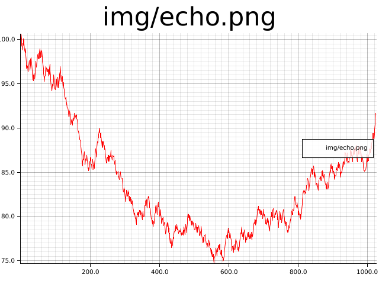</img>
</a>

<a href="https://github.com/MathisWellmann/sliding_features-rs/blob/master/src/sma.rs"> 
    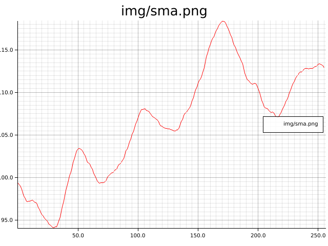</img>
</a>

<a href="https://github.com/MathisWellmann/sliding_features-rs/blob/master/src/ema.rs"> 
    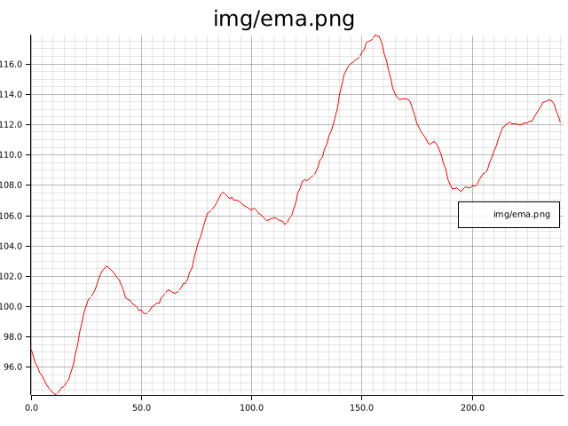</img>
</a>

<a href="https://github.com/MathisWellmann/sliding_features-rs/blob/master/src/alma.rs"> 
    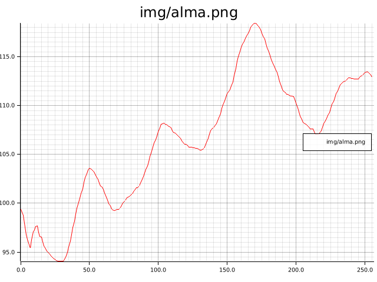</img>
</a>

<a href="https://github.com/MathisWellmann/sliding_features-rs/blob/master/src/laguerre_filter.rs"> 
    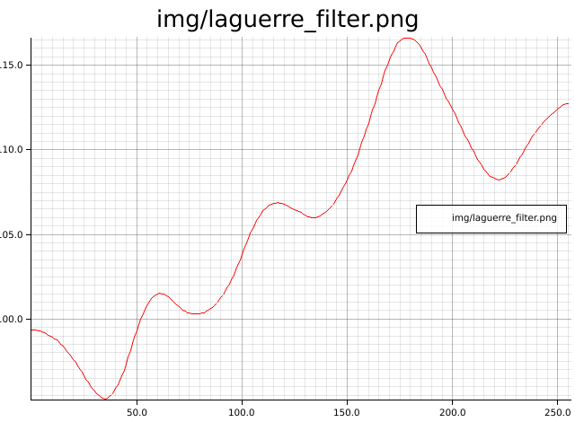</img>
</a>

<a href="https://github.com/MathisWellmann/sliding_features-rs/blob/master/src/rsi.rs"> 
    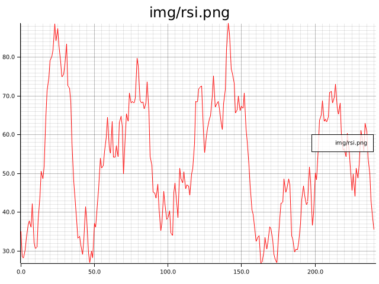</img>
</a>

<a href="https://github.com/MathisWellmann/sliding_features-rs/blob/master/src/laguerre_rsi.rs"> 
    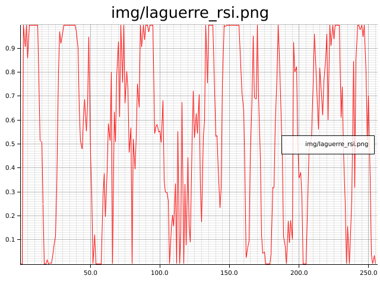</img>
</a>

<a href="https://github.com/MathisWellmann/sliding_features-rs/blob/master/src/my_rsi.rs"> 
    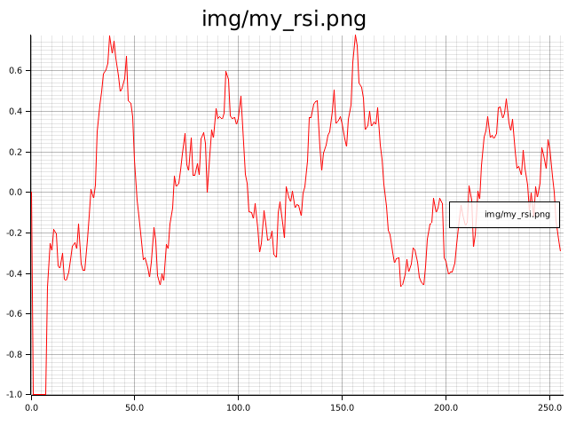</img>
</a>

<a href="https://github.com/MathisWellmann/sliding_features-rs/blob/master/src/net_my_rsi.rs"> 
    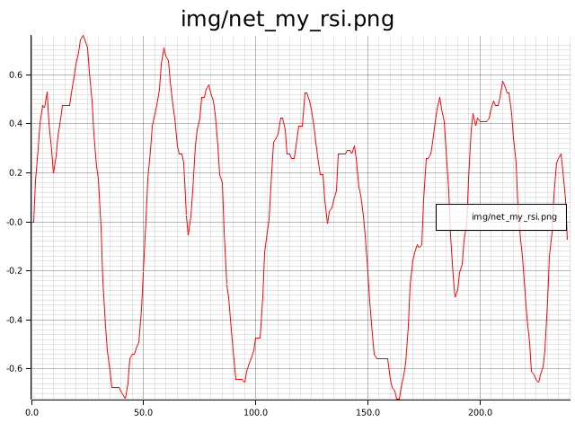</img>
</a>

<a href="https://github.com/MathisWellmann/sliding_features-rs/blob/master/src/roc.rs"> 
    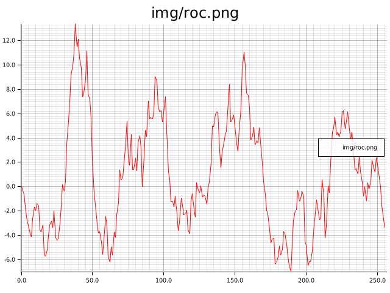</img>
</a>

<a href="https://github.com/MathisWellmann/sliding_features-rs/blob/master/src/center_of_gravity.rs"> 
    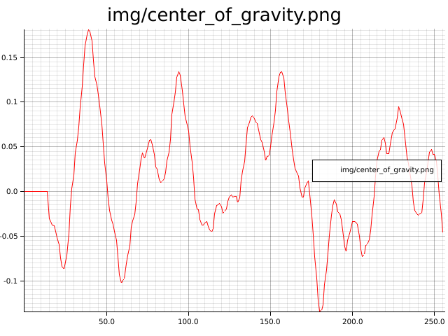</img>
</a>

<a href="https://github.com/MathisWellmann/sliding_features-rs/blob/master/src/normalizer.rs"> 
    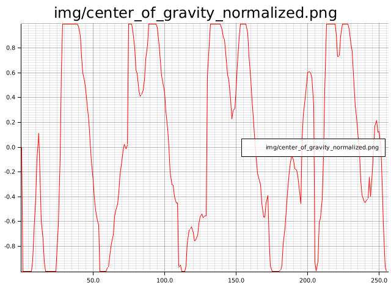</img>
</a>

<a href="https://github.com/MathisWellmann/sliding_features-rs/blob/master/src/cyber_cycle.rs"> 
    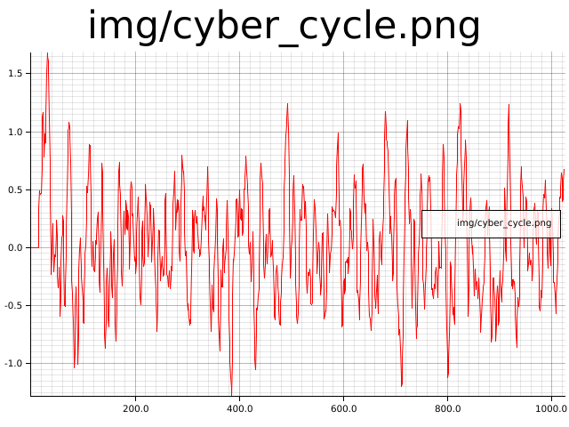</img>
</a>

<a href="https://github.com/MathisWellmann/sliding_features-rs/blob/master/src/re_flex.rs"> 
    </img>
</a>

<a href="https://github.com/MathisWellmann/sliding_features-rs/blob/master/src/trend_flex.rs"> 
    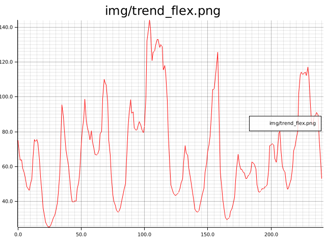</img>
</a>

<a href="https://github.com/MathisWellmann/sliding_features-rs/blob/master/src/correlation_trend_indicator.rs"> 
    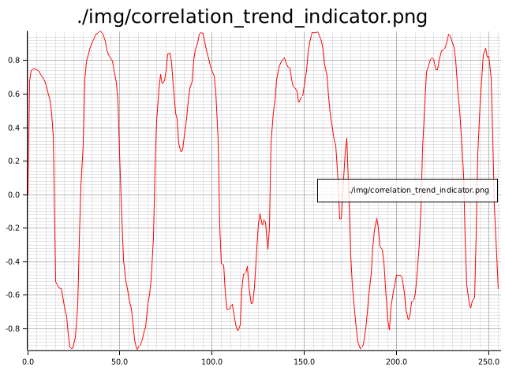</img>
</a>

<a href="https://github.com/MathisWellmann/sliding_features-rs/blob/master/src/vsct.rs"> 
    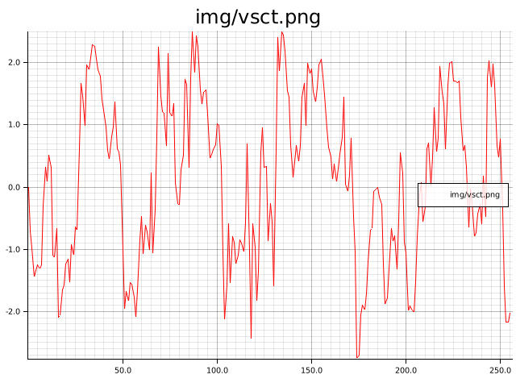</img>
</a>

<a href="https://github.com/MathisWellmann/sliding_features-rs/blob/master/src/welford_online_sliding.rs"> 
    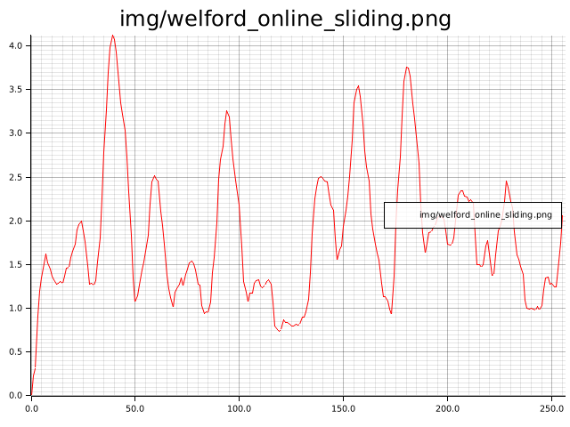</img>
</a>

<a href="https://github.com/MathisWellmann/sliding_features-rs/blob/master/src/polarized_fractal_efficiency.rs"> 
    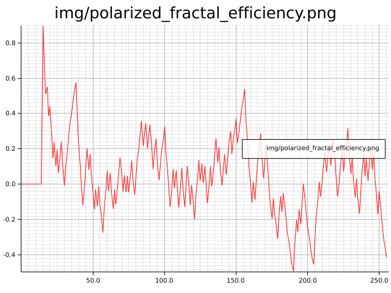</img>
</a>

<a href="https://github.com/MathisWellmann/sliding_features-rs/blob/master/src/ehlers_fisher_transform.rs"> 
    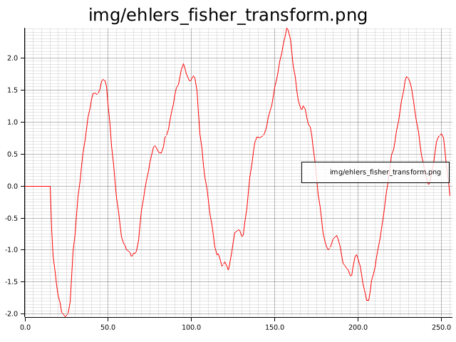</img>
</a>

<a href="https://github.com/MathisWellmann/sliding_features-rs/blob/master/src/cumulative.rs"> 
    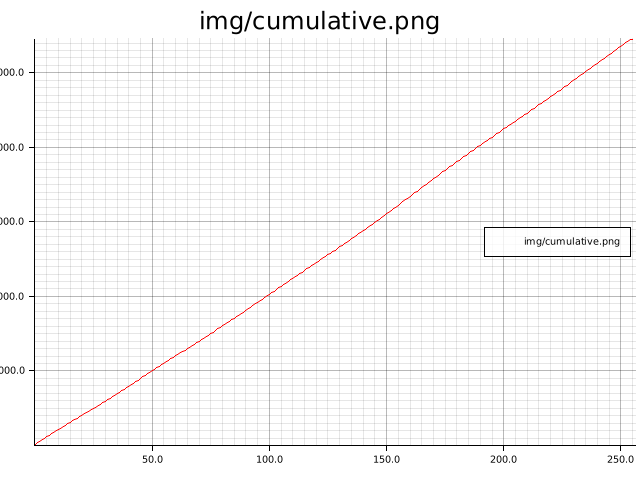</img>
</a>

### TODOs:
Feel free to implement the following and create a PR for some easy open-source contributions:
- Roofing Filter
- FRAMA
- MAMA
- FAMA
- Stochastic
- Super Smoother
- Zero Lag
- gaussian filter
- correlation cycle indicator
- some indicators can be built with const sized arrays, for better performance
- add Default impl for all
- and so much more...

### Contributing
If you have a sliding window function or indicator which you would like to integrate,
feel free to create a pull request. Any help is highly appreciated.
Let's build the greatest sliding window library together :handshake:

### Donations :moneybag: :money_with_wings:
I you would like to support the development of this crate, feel free to send over a donation:

Monero (XMR) address:
```plain
47xMvxNKsCKMt2owkDuN1Bci2KMiqGrAFCQFSLijWLs49ua67222Wu3LZryyopDVPYgYmAnYkSZSz9ZW2buaDwdyKTWGwwb
```


## License
Copyright (C) 2020  <MathisWellmann wellmannmathis@gmail.com>

This program is free software: you can redistribute it and/or modify
it under the terms of the GNU Affero General Public License as published by
the Free Software Foundation, either version 3 of the License, or
(at your option) any later version.

This program is distributed in the hope that it will be useful,
but WITHOUT ANY WARRANTY; without even the implied warranty of
MERCHANTABILITY or FITNESS FOR A PARTICULAR PURPOSE.  See the
GNU Affero General Public License for more details.

You should have received a copy of the GNU Affero General Public License
along with this program.  If not, see <https://www.gnu.org/licenses/>.


